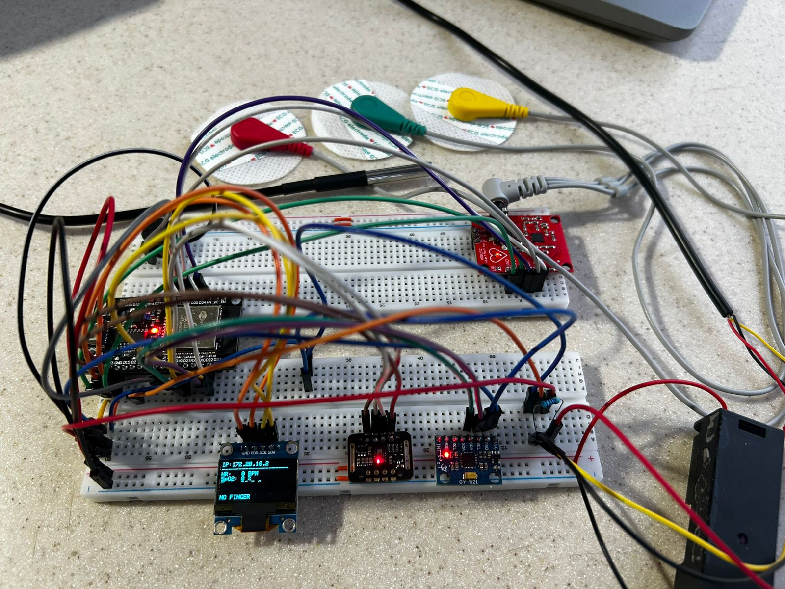
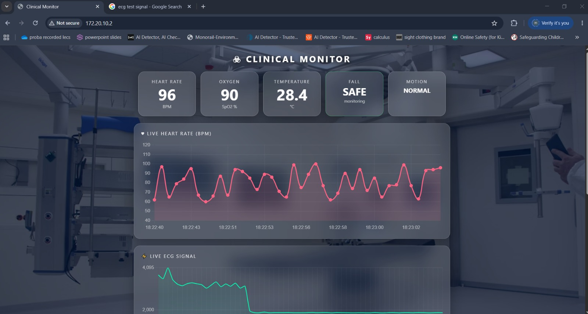

# 🩺 IoT Health Monitoring System

An ESP32-based IoT Health Monitoring System that monitors patient vital signs in real time and displays them through a web dashboard.

---

## 📖 Overview

This project uses an ESP32 microcontroller to collect data from multiple biomedical sensors. The measured values are displayed on an OLED screen and transmitted over Wi-Fi to a browser-based dashboard. The system also activates an alarm when abnormal conditions are detected.

---

## 🚀 Features

- ❤️ Real-time Heart Rate Monitoring
- 🩸 Blood Oxygen (SpO₂) Monitoring
- 🌡 Body Temperature Monitoring
- 📈 ECG Signal Acquisition
- 🚶 Fall Detection
- 📺 OLED Display
- 🌐 Wi-Fi Web Dashboard
- 📡 Live Sensor Data
- 🚨 Buzzer Alarm for Critical Conditions

---

## 🛠 Hardware Components

- ESP32
- MAX30102 Pulse Oximeter Sensor
- AD8232 ECG Sensor
- DS18B20 Temperature Sensor
- MPU6050 Accelerometer & Gyroscope
- SSD1306 OLED Display
- Active Buzzer

---

## 💻 Technologies Used

- ESP32
- Arduino IDE
- C++
- HTML
- Wi-Fi
- Arduino WebServer Library
- Chart.js
- I2C Communication

---

## 📚 Arduino Libraries

- Wire
- Adafruit_GFX
- Adafruit_SSD1306
- MAX30105
- OneWire
- DallasTemperature
- WiFi
- WebServer
- MPU6050

---

## 📷 Hardware Prototype



---

## 🌐 Web Dashboard



---

## 📈 ECG Dashboard


---

## 📁 Project Structure

```text
iot-health-monitoring-system/
│
├── firmware/
│   └── health_monitor.ino
│
├── docs/
│   ├── IoT_Health_Monitoring_Report.pdf
│   └── README.md
│
├── images/
│   ├── hardware-setup.jpg
│   ├── dashboard-overview.png
│   └── ecg-dashboard.png
│
├── README.md
└── LICENSE
```

---

## ▶️ Getting Started

1. Install Arduino IDE.
2. Install the required libraries.
3. Update the Wi-Fi credentials in the code.
4. Upload the firmware to the ESP32.
5. Open the Serial Monitor to find the ESP32 IP address.
6. Open the IP address in your web browser to access the dashboard.

---

## 👩‍💻 Author

**Malak Tamer ElSayed**

---

## 📄 License

This project is licensed under the MIT License.
